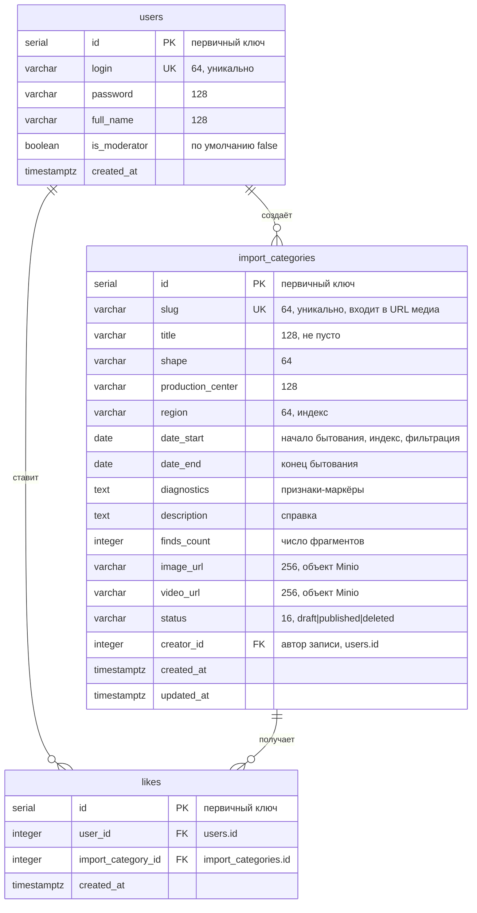

# Структура базы данных (ЛР2)

Три таблицы: услуги (`import_categories`), пользователи (`users`)
и связь «многие ко многим» между ними — лайки (`likes`).

## Схема



## Таблицы подробно

### users — пользователи

| Столбец | Тип | Ограничения |
|---|---|---|
| id | serial | PK |
| login | varchar(64) | NOT NULL, UNIQUE |
| password | varchar(128) | NOT NULL (хеширование появится в ЛР4) |
| full_name | varchar(128) | |
| is_moderator | boolean | NOT NULL, DEFAULT false |
| created_at | timestamptz | |

### import_categories — услуги (категории импорта)

| Столбец | Тип | Ограничения |
|---|---|---|
| id | serial | PK |
| slug | varchar(64) | NOT NULL, UNIQUE |
| title | varchar(128) | NOT NULL |
| shape | varchar(64) | |
| production_center | varchar(128) | |
| region | varchar(64) | NOT NULL, INDEX |
| date_start | date | NOT NULL, INDEX — поле фильтрации |
| date_end | date | NOT NULL |
| diagnostics | text | |
| description | text | |
| finds_count | integer | NOT NULL, DEFAULT 0 |
| image_url | varchar(256) | ссылка на объект в Minio |
| video_url | varchar(256) | ссылка на объект в Minio |
| status | varchar(16) | NOT NULL, DEFAULT 'draft', INDEX |
| creator_id | integer | FK → users(id), INDEX |
| created_at, updated_at | timestamptz | проставляет GORM |

Дополнительное ограничение, которого нет в тегах ORM и которое создаётся
отдельным SQL-запросом в `cmd/migrate/main.go`:

```sql
CREATE UNIQUE INDEX uniq_draft_per_user
    ON import_categories (creator_id)
 WHERE status = 'draft';
```

Это частичный уникальный индекс: у одного пользователя может быть только один
черновик.

### likes — связь «многие ко многим»

| Столбец | Тип | Ограничения |
|---|---|---|
| id | serial | PK |
| user_id | integer | NOT NULL, FK → users(id) |
| import_category_id | integer | NOT NULL, FK → import_categories(id) |
| created_at | timestamptz | |

Пара `(user_id, import_category_id)` объявлена уникальным индексом
`idx_likes_user_category`, поэтому один пользователь не может отметить одну
и ту же категорию дважды.

## Связи

* `users` → `import_categories` — один ко многим: пользователь создаёт
  категории (`creator_id`).
* `users` ↔ `import_categories` — многие ко многим через `likes`:
  пользователь отмечает произвольное число категорий, категорию отмечает
  произвольное число пользователей.

## Как перенести схему в StarUML

1. Установить StarUML и открыть **Model → Add Diagram → Entity-Relationship Diagram**.
2. На панели инструментов выбрать **Entity** и поставить три сущности:
   `users`, `import_categories`, `likes`.
3. Для каждой сущности: правый клик → **Add → Column**; вписать имя столбца,
   в панели свойств справа задать **Type** (INTEGER, VARCHAR, TEXT, DATE,
   BOOLEAN, TIMESTAMP) и **Length** по таблицам выше.
4. У первичных ключей поставить галочку **Primary Key**, у внешних —
   **Foreign Key**.
5. Связи рисуются инструментом **Relationship**: от `users` к
   `import_categories` (1 : N), от `users` к `likes` (1 : N),
   от `import_categories` к `likes` (1 : N). В свойствах связи задать
   кардинальность: у «родителя» `1`, у «потомка» `0..*`.
6. Экспорт: **File → Export Diagram As → PNG** — эту картинку и вставлять
   в отчёт.

Проверить себя можно по Adminer: `http://localhost:8081` → база `amphora` →
кнопка **Схема БД** показывает те же три таблицы и связи между ними.
