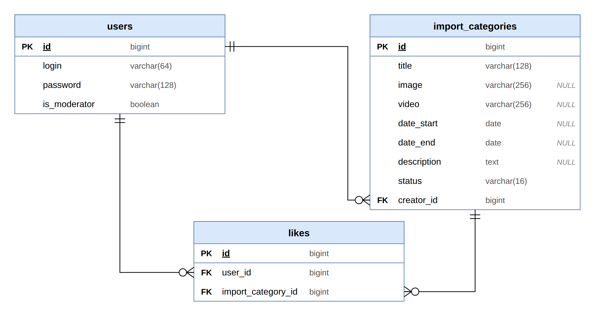

# ER-диаграмма базы данных «Амфора» (ЛР2)



Исходник для редактирования — [er.drawio](er.drawio) (открывается на app.diagrams.net:
«Файл → Открыть с → Устройство»). Картинка пересобирается скриптом `tools/gen_er.py`.

## Таблицы

### users — пользователи

| Поле | Тип | Ограничения |
|---|---|---|
| id | bigint | PK |
| login | varchar(64) | NOT NULL, UNIQUE |
| password | varchar(128) | NOT NULL |
| is_moderator | boolean | NOT NULL, DEFAULT false |

### import_categories — услуги (категории импорта)

| Поле | Тип | Ограничения | Когда заполняется |
|---|---|---|---|
| id | bigint | PK | — |
| title | varchar(128) | NOT NULL | создание (POST) |
| image | varchar(256) | NULL | POST: сервер пишет имя загруженного файла |
| video | varchar(256) | NULL | POST: сервер пишет имя загруженного файла |
| date_start | date | NULL, INDEX | публикация (PUT) |
| date_end | date | NULL | публикация (PUT) |
| description | text | NULL | публикация (PUT) |
| status | varchar(16) | NOT NULL, DEFAULT 'draft' | draft → published → deleted |
| creator_id | bigint | NOT NULL, FK → users.id | на сервере (singleton) |

Поля по теме — только два: **date_start** и **date_end** (дата начала и дата конца
бытования типа). Фильтрация в плитке — по date_start.

### likes — связь «многие ко многим»

| Поле | Тип | Ограничения |
|---|---|---|
| id | bigint | PK |
| user_id | bigint | NOT NULL, FK → users.id |
| import_category_id | bigint | NOT NULL, FK → import_categories.id |

Пара `(user_id, import_category_id)` уникальна.

## Связи

* users 1 — 0..N import_categories (пользователь создаёт услуги; создатель обязателен);
* users 1 — 0..N likes;
* import_categories 1 — 0..N likes.

Через `likes` пользователи и услуги связаны «многие ко многим».
Все связи обязательны со стороны «один»: внешние ключи NOT NULL.

## Ограничение на черновик

```sql
CREATE UNIQUE INDEX uniq_draft_per_user
    ON import_categories (creator_id)
 WHERE status = 'draft';
```

Частичный уникальный индекс: у одного пользователя может быть только один черновик.
